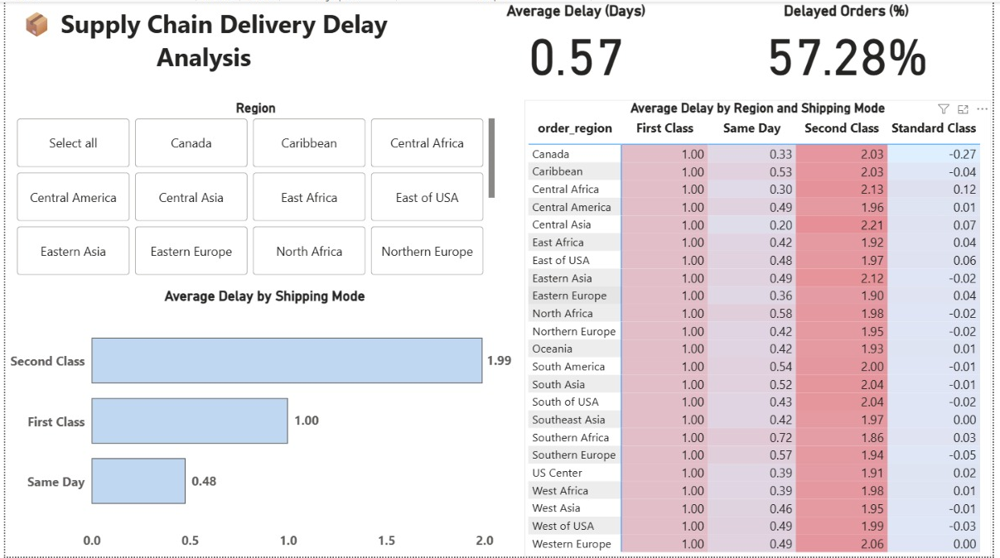

# Supply Chain Delivery Delay Analysis

## Project Overview
This project analyzes delivery delays in a global supply chain to identify which shipping modes and regions are most prone to late deliveries. SQL was used to clean and analyze shipment data, and Power BI was used to create an interactive dashboard that highlights delay patterns and operational risks.

---

## Tech Stack
- **SQL (PostgreSQL):** Data cleaning, handling missing values, and aggregating shipping timelines  
- **Power BI:** Interactive dashboard development and KPI tracking  
- **Data Source:** Supply Chain Delivery Dataset (<a href="https://www.kaggle.com/datasets/shashwatwork/dataco-smart-supply-chain-for-big-data-analysis">Kaggle</a>)

---

## Dashboard Overview

---

## Key Analysis & Insights
- Identified shipping modes that consistently exceed scheduled delivery timelines  
- Analyzed delivery delays across geographic regions to highlight high-risk areas  
- Compared late vs on-time delivery patterns to support logistics planning decisions  

---

## Business Insights
- Certain shipping classes showed significantly higher average delays  
- Specific regions exhibited consistent delivery risks  
- Standard Class shipping demonstrated more reliable delivery performance  

---

## Outcome
This analysis demonstrates how SQL-driven data exploration combined with interactive dashboards can support data-informed decision-making in supply chain operations.
